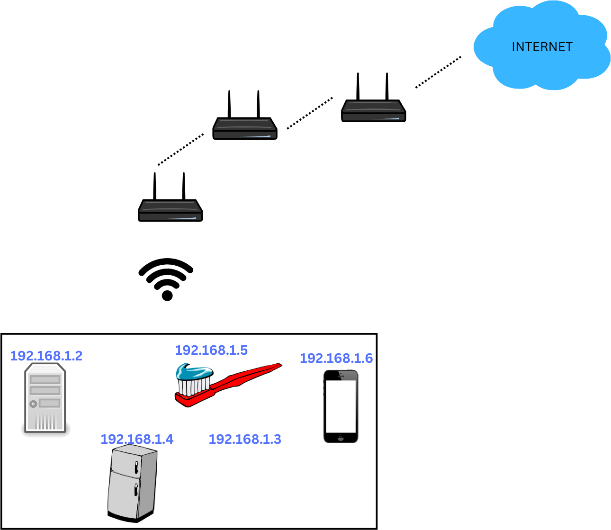
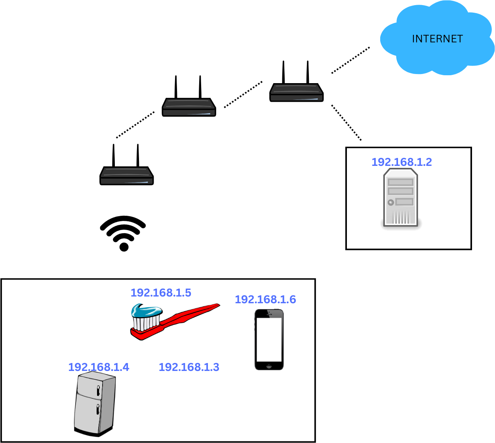

# Marco Polo

Marco polo will help you find the real IP behind any server, most common use is you want to get the real IP for servers behind any WAF, like cloudflare, akamai or imperva, these websites sometimes rely on them 100% and they forget their IP still public and direct attacks still happen and they misconfigured the serve

## This is how the design looks for websites behind a WAF:


So with this project you will be able to get the IP from real server, X.X.X.X


To run the code you will need to Golang: https://go.dev/dl/

## Download and run the project: 
```bash
    git clone https://github.com/johnbalvin/marcopolo
```
Use it as it is, then wait for completition


## Run the project: 
```bash
    go run .
```
## setup the website target
```go
   Input{
      URL:        utils.ParseURL("https://secure.state.co.nz/car"),
      Keyworkds:  []string{"State Insurance", "secure.state.co.nz/car/favicon.ico"},
      BufferSize: 2048,
      Asn: asn.Asn{
         PrioritiesNames: []string{"IAG New Zealand"},
         ForbiddenNames:  ForbidenASN,
      },
   }
```
## setup the variables as need it, you need to set the tcp timeout and threads depending on your network enviroment
```go
   func main() {
      input := Input{ //this is the default host, fill the variables as you need it
         URL:        utils.ParseURL("https://secure.state.co.nz/car"),                  //and url to test on on
         Keyworkds:  []string{"State Insurance", "secure.state.co.nz/car/favicon.ico"}, //keywords presented on the body, use keywords presented on the first bytes of the body
         BufferSize: 2048,
         Asn: asn.Asn{
            PrioritiesNames: []string{"IAG New Zealand"}, //ASN name based on your DNS investigation
            ForbiddenNames:  ForbidenASN,
         },
      }
      threadsKeywords := 80
      threadsSSLVerification := 150
      tcpTimeout := time.Second
      sslTimeout := time.Second * 5 //it's ok this one to be bigger than the TCP timeout, at the end it will search an small portion of IPs so no need to worry
      asnPath := "./asn.csv"
      outputFolder := "./results"
      stopOnASNFound := true // it will stop once an IP is found on an ASN number, still will search on others ASN
      input.SearchByKeywords(stopOnASNFound, threadsKeywords, threadsSSLVerification, tcpTimeout, sslTimeout, asnPath, outputFolder)
      //Uncoment in case you need an IP with valid SSL certificate
      //stopOnSSlFound := true // it will stop once a valid SSL for that domain is found
      //input.SearchBySSLCertificatesOnly(stopOnSSlFound, threadsNumber, sslTimeout, asnPath, outputFolder)
   }

```

## If you just want to check the SSL from the IP

 Some IP won't response back on a GET request but for some reason they response with a valid SSL certificate

```go
   // USE CABLE AND NOT WIFI, DIRECT CABLE WILL BE BETTER FOR THIS PROJECT
   func main() {
      input := Input{ //this is the default host, fill the variables as you need it
         URL:        utils.ParseURL("https://secure.state.co.nz/car"),                  //url to test on
         Asn: asn.Asn{
            PrioritiesNames: []string{"IAG New Zealand"}, //ASN name based on your DNS investigation
            ForbiddenNames:  ForbidenASN,
         },
      }
      threadsSSLVerification := 150
      sslTimeout := time.Second * 5 
      asnPath := "./asn.csv"
      outputFolder := "./results"
      stopOnSSlFound := true // it will stop once a valid SSL for that domain is found
      input.SearchBySSLCertificatesOnly(stopOnSSlFound, threadsSSLVerification, sslTimeout, asnPath, outputFolder)
   }
```
You need:

* **URL**: which url you are gonna test
* **Keyworkds**: what keywords are on the body, try to get this keyboard from the first bytes from the html
* **TCPTimeout**: play aroung with this value depending on your network enviroment
* **Asn.PrioritiesNames**: what is the ASN names to filter out


## Optimizations

To get faster results you need to config your machine to perform the best way possible, one way is to get rid of any intermediary so if you have a step like this: 

Conect directly by cable to the primary router: 
Instead of using your pc with wifi or intermediary router:



Use direct cable to the the main router:



###  Linux configuration

#### debian

```bash
   sudo mv config_debian.txt /etc/sysctl.conf
```
```bash
   sudo modprobe nf_conntrack
```
```bash
   sudo sysctl -p
```
verify ports number
```bash
   ulimit -n 
```
```bash
   sudo mv tcplimits.txt /etc/security/limits.conf
```
Logout and login again

see the change:
```bash
   ulimit -n 
```

#### Freebsd
```bash
   su
```
```bash
   mv config_freebsd.txt /etc/sysctl.conf
```
    
```bash
   sysctl -f /etc/sysctl.conf
```
```bash
   ulimit -n 
```
```bash
   mv tcplimits.txt /etc/security/limits.conf
```
Logout and login again
```bash
   ulimit -n 
```

